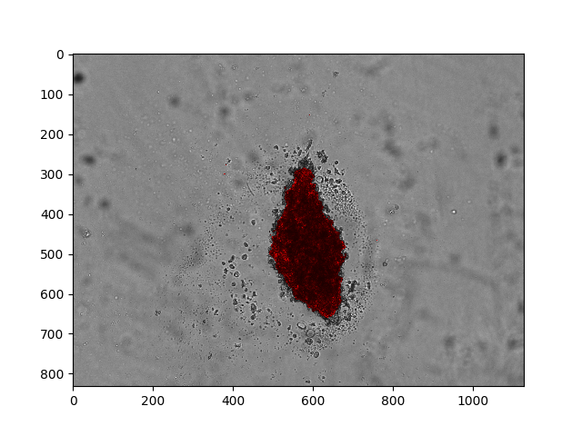
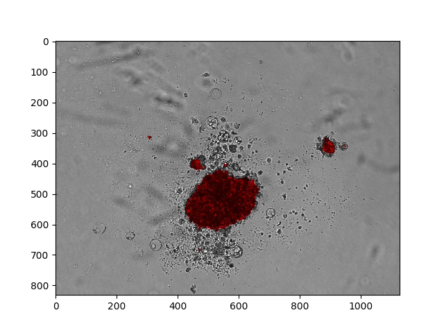

# Segmentation of Speroid Cancer Cells

## Getting started
[data_utils.py](data_utils.py): For most data processing works;

[Unet_training.py](Unet_training.py): This builds up the model and trains it;

[Unet_evaluation.py](Unet_evaluation.py): This runs tests and visualize the results in different forms;

[cell_analysis.py](cell_analysis.py): This is for analysis of the segmented masks;

## Results

Samples from Test set:
* Overlay predicted masks with raw images:

